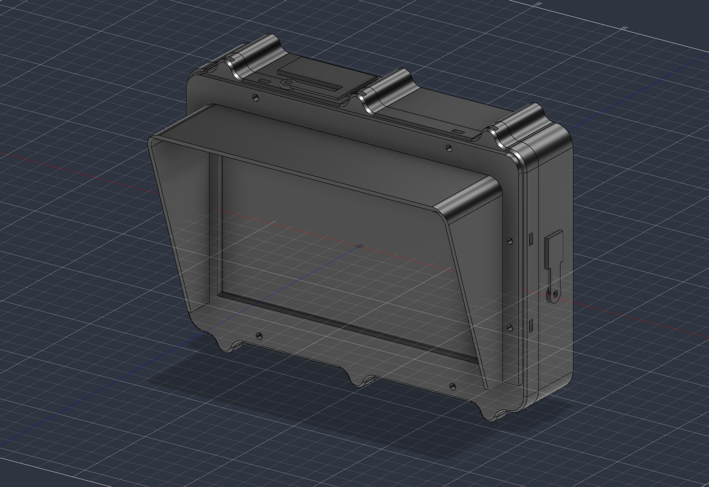
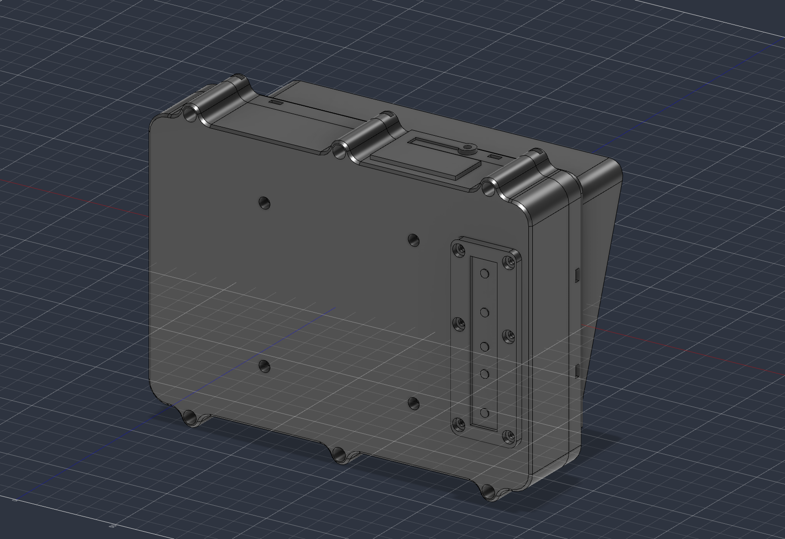

# Rugged Monitor EP-0084

Caixa robusta, impressa em 3D, para o ecrã de 7" com toque capacitivo
[52Pi EP-0084](https://wiki.52pi.com/index.php/EP-0084) (1024×600, HDMI, toque por USB).

- Dimensões exteriores: 192,9 × 148,9 × 40,5 mm
- Suporte VESA 75
- Proteção contra choques, pó e salpicos (junta entre moldura e tampa, tampões nas portas)
- HDMI e alimentação na aresta de cima, micro-USB do toque na lateral
- Botões do menu acessíveis por fora, através de teclas em TPU
- Pala de sol destacável, para uso no painel do automóvel

## Peças

Os ficheiros em `out/` abrem já na posição de impressão e não precisam de suportes.

| Ficheiro | Material | Volume |
|---|---|---|
| `moldura-frontal.stl` | Rígido | 90 cm³ |
| `chassis.stl` | Rígido | 46 cm³ |
| `tampa-traseira.stl` | Rígido | 184 cm³ |
| `aro-teclas.stl` | Rígido | 7 cm³ |
| `pala-de-sol.stl` | Rígido | 42 cm³ |
| `teclas-tpu.stl` | TPU 95A | 2 cm³ |
| `tampao-hdmi-dc-tpu.stl` | TPU 95A | 4 cm³ |
| `tampao-usb-tpu.stl` | TPU 95A | 1 cm³ |

Material rígido: ASA para uso no automóvel (o PETG amolece perto dos 80 °C e o PLA
não serve); PETG chega para uso em interior.

Provas de encaixe, para validar folgas antes das peças grandes:
`prova-alojamento.stl` (alojamento do LCD), `prova-ferragens.stl` (rasgos de porca e
furos) e `prova-portas.stl` (paredes das portas da tampa).

`rugged-monitor.step` tem o conjunto completo, incluindo os componentes do kit como
referência.

## Ferragens

| Qtd. | Peça | Onde |
|---|---|---|
| 6 | Parafuso M3×20, cabeça cilíndrica (DIN 912) | Fecho da tampa contra a moldura |
| 5 | Parafuso M3×16, cabeça abaulada (ISO 7380) | Pinos das teclas |
| 31 | Parafuso M3×10, cabeça abaulada (ISO 7380) | Chassis (9), placas (6), aro das teclas (6), pala (6), teclado OSD (2), hastes dos tampões (2) |
| 29 | Porca sextavada M3 normal (DIN 934) | Fecho (6), chassis (9), placas (6), pala (8) |
| 10 | Inserto roscado M3, a quente | Aro das teclas (6), teclado OSD (2), hastes dos tampões (2) |
| 4 | Inserto roscado M4, a quente | Suporte VESA |
| 4 | Parafuso M4×8 | Suporte VESA |
| — | Cola de silicone neutro | Junta entre moldura e tampa |
| — | Fita de espuma adesiva de 1 mm | Entre a aba frontal e o vidro; entre o LCD e o chassis |

Nenhum parafuso rosca diretamente no plástico: usam-se porcas presas em rasgos onde
há acesso, e insertos de latão nos furos cegos que não podem atravessar a parede.

## Montagem, em resumo

1. Meter as 9 porcas do chassis nos rasgos da parede do alojamento do LCD.
2. Colar a espuma na aba e pousar o conjunto LCD + vidro, com os flats do lado dos batentes.
3. Encaixar as 6 porcas por baixo do chassis, passar os flats pelos rasgos e aparafusar o chassis.
4. Montar a placa de vídeo e a do toque no chassis e ligar os flats.
5. Na tampa: aplicar os insertos, meter os pinos das teclas, montar o teclado OSD, a tira de teclas e o aro.
6. Fechar a tampa com os 6 parafusos M3×20.

A junta é moldada no local: silicone na valeta da moldura, desmoldante no ressalto
da tampa, curar com a caixa fechada e vazia.

## Regenerar o modelo

O modelo é gerado pelo script `fusion/RuggedMonitor/RuggedMonitor.py`, para o Autodesk
Fusion. Todas as cotas estão no dicionário `P`, no topo do ficheiro.

1. Copiar (ou ligar) a pasta `fusion/RuggedMonitor` para a pasta de scripts do Fusion.
2. No Fusion: Utilities → Scripts and Add-Ins → RuggedMonitor → Run.

O script reconstrói o documento "Rugged Monitor" se estiver aberto (senão cria um novo)
e grava os STL, o STEP e as imagens em `out/`.

## Estado

Moldura, chassis e tampa foram impressos e validados com o hardware real. As teclas
(tira de TPU, pinos e aro), os tampões e a junta de silicone ainda não foram testados.
